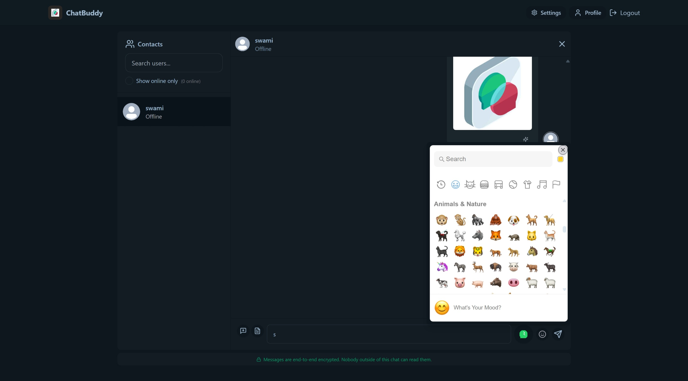
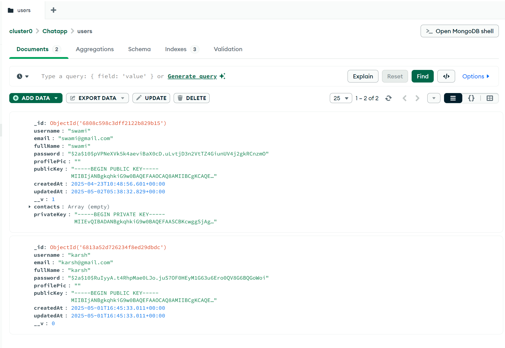

# ChatBuddy - An AI Powered Secure Chat App

ChatBuddy is a modern, full-stack chat application featuring end-to-end encryption, AI-powered smart replies, sentiment analysis, and conversation summarization. Built with React, Node.js, Express, MongoDB, and integrates with Ollama and HuggingFace for AI features.

## Features

- **End-to-End Encrypted Messaging** (RSA + AES)
- **User Authentication** (JWT, bcrypt)
- **Profile Management** (avatar upload, update info)
- **File & Image Sharing** (Cloudinary integration)
- **AI Smart Replies** (Ollama LLM)
- **Sentiment Analysis** (HuggingFace or local)
- **Conversation Summarization** (Ollama LLM)
- **Real-Time Messaging** (Socket.io)
- **Theme Customization** (DaisyUI, Tailwind)
- **Responsive UI** (React, Vite, DaisyUI)

## Screenshots







## Tech Stack

- **Frontend:** React, Vite, Zustand, DaisyUI, TailwindCSS, Socket.io-client
- **Backend:** Node.js, Express, MongoDB, Mongoose, Socket.io, Cloudinary, Ollama, HuggingFace
- **AI:** Ollama (LLM), HuggingFace (Sentiment)
- **Security:** JWT, bcrypt, RSA/AES encryption

## Getting Started

### Prerequisites

- Node.js (v18+)
- MongoDB
- [Ollama](https://ollama.ai) (for local AI features)
- Cloudinary account (for file uploads)
- (Optional) HuggingFace API key for advanced sentiment analysis

### Installation

1. **Clone the repository:**
   ```sh
   git clone https://github.com/yourusername/chatbuddy.git
   cd chatbuddy
   ```

2. **Install dependencies:**
   ```sh
   npm install
   cd backend && npm install
   cd ../frontend && npm install
   ```

3. **Configure environment variables:**

   - Copy `.env.example` to `.env` in `backend/` and fill in:
     ```
     PORT=5001
     MONGODB_URI=your_mongodb_uri
     JWT_SECRET=your_jwt_secret
     CLOUDINARY_CLOUD_NAME=your_cloud_name
     CLOUDINARY_API_KEY=your_api_key
     CLOUDINARY_API_SECRET=your_api_secret
     HF_TOKEN=your_huggingface_token # (optional)
     NODE_ENV=development
     ```

4. **Start MongoDB** (if not already running).

5. **Start Ollama** (for AI features):
   ```sh
   ollama serve
   ```

6. **Run the app:**
   - In the project root:
     ```sh
     npm run build
     npm start
     ```
   - Or, for development (with hot reload):
     ```sh
     cd backend && npm run dev
     cd ../frontend && npm run dev
     ```

7. **Open the app:**
   - Visit [http://localhost:5173](http://localhost:5173) in your browser.

## Usage

- **Sign up** for a new account.
- **Start chatting** with contacts, send files, images, and use AI features.
- **Change theme** in settings.
- **Update your profile** and avatar.

## Project Structure

```
backend/
  src/
    controllers/
    lib/
    middleware/
    models/
    routes/
    seeds/
    utils/
frontend/
  src/
    components/
    constants/
    lib/
    pages/
    store/
    ...
screenshots/
```

## License

This project is licensed under the MIT License.

---

**Made with ❤️ by [Your Name]**
